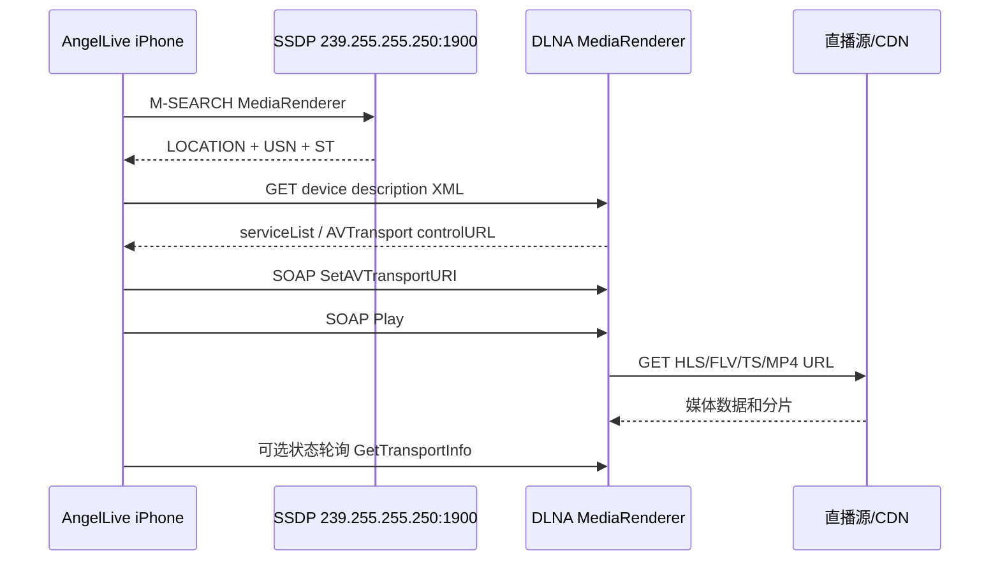

# iOS DLNA 投屏调研

> 状态: 第三阶段（自定义请求头代理）已完成 · 待真实设备验证
> 更新于: 2026-07-29
> 范围: AngelLive iOS 端直播 URL 投送到局域网 DLNA/UPnP MediaRenderer

## 0. 结论先行

DLNA 可以接入 AngelLive，但它不是 iPhone 屏幕镜像。公开播放源仍由电视直接拉流；需要自定义 User-Agent、Referer、Cookie 或授权头的播放源会改用 iPhone 局域网代理，由代理携带原请求头访问源站。代理支持重写 HLS 子清单、分片、密钥和初始化片段 URL，并流式转发 FLV、MPEG-TS 与 MP4。FLV 仍属于实验性兼容格式，不代表普通电视一定支持。

正式实现建议使用项目内的轻量 DLNA 模块，复用现有 `CocoaAsyncSocket` 做 SSDP，使用 `URLSession` 做设备描述和 SOAP HTTP 控制。`SwiftUPnP` 可用于 PoC 或作为协议参考，但不建议未经 fork 直接接入；其分支依赖会和 AngelLive 当前 SwiftPM 依赖产生解析和可复现性风险。

当前建议：

1. 先实现独立的 DLNA 设备列表和 `SetAVTransportURI`/`Play`/`Stop` PoC。
2. 仅向兼容性评估通过的播放源显示 DLNA 入口。
3. 用真实电视验证后，再决定是否把 DLNA 设备加入 `AVRoutePickerView` 的统一选择器。

当前仓库已经落地 DLNA 发现、AVTransport 控制、状态轮询和本地媒体代理。`AngelLiveCore` 的 `DLNAMediaResource` 会保留播放请求头；`AngelLiveDependencies` 使用随机会话令牌启动局域网 HTTP 代理，避免暴露为开放代理。无 Header 的源仍直接投送原 URL，有 Header 的源才经过手机代理。代理会转发 Range 和常用媒体响应头；会话主动停止、失败或远端停止时释放令牌，兜底令牌最长保留 24 小时。真实电视兼容性、后台挂起行为、组播权限 profile 和短时效 URL 仍需真机验证。

## 1. 与现有代码的关系

| 位置 | 当前行为 | 对 DLNA 的影响 |
|---|---|---|
| `iOS/AngelLive/AngelLive/FullUI/Views/Player/AirPlayView.swift` | 使用 `AVRoutePickerView` 展示 AirPlay 路由 | 不会自动发现普通 DLNA 电视；DLNA 需要单独的发现和控制链路 |
| `SettingsButton.swift` | 仅在 `isHLSStream` 时显示投屏入口 | 可复用入口，但 DLNA 不能简单等同于 AirPlay；应增加独立设备状态和兼容性判断 |
| `RoomInfoViewModel.swift` | 记录当前 URL、播放器类型和 HLS 状态 | 可作为 Cast 请求的来源，但需要同时读取流格式、请求头和 URL 时效性 |
| `RoomPlaybackResolver.swift` | 支持自定义 User-Agent、Referer、Cookie 等请求头 | 电视直接取流时通常无法携带这些请求头，是投屏失败的主要来源 |
| `Info.plist` | 已有 `NSLocalNetworkUsageDescription` 和 AngelLive 自有 Bonjour 服务 | 本地网络文案需要覆盖电视发现/投送；现有 Bonjour 服务不等于 SSDP |
| `AngelLive.entitlements` | ✅ 已写入 `com.apple.developer.networking.multicast`(2026-07-31 核对) | 仓库侧已就位；仍需确认 App ID capability 与实际签名用的 provisioning profile 同步生效 |
| iOS target | iOS 17 | 可使用 Swift 并发；`AVCustomRoutingController` 也满足系统版本要求 |

现有 AirPlay 逻辑继续保留。DLNA 是额外的投送方式，不应修改成“所有设备都走 `AVRoutePickerView`”。

## 2. DLNA 工作链路

DLNA 投屏的媒体数据路径如下，iPhone 只负责发现和发控制命令，电视负责访问直播源：



### 2.1 发现

- 发送 UDP M-SEARCH 到 `239.255.255.250:1900`。
- 首选搜索目标：`urn:schemas-upnp-org:device:MediaRenderer:1`。
- 对部分电视可增加 `ssdp:all` 兜底，但必须在客户端过滤 `MediaRenderer`，避免把 MediaServer、路由器等设备显示给用户。
- 解析响应中的 `LOCATION`、`USN`、`ST`、`CACHE-CONTROL`，以 UDN/USN 去重并设置设备过期时间。
- GET `LOCATION` 返回的 device description XML，找到 `AVTransport`、可选的 `RenderingControl` 服务及其 `controlURL`。

### 2.2 控制

最小可用命令集：

1. `SetAVTransportURI`：设置 `CurrentURI` 和 `CurrentURIMetaData`。
2. `Play`：通常使用速度 `1`。
3. `Stop`：切换设备或退出投屏时调用。
4. `GetTransportInfo`：确认设备是否进入 `PLAYING`/`PAUSED_PLAYBACK`/`STOPPED`。

第二阶段再考虑：

- `Pause`、`Seek`、`GetPositionInfo`；直播通常没有可用的总时长和 seek。
- `RenderingControl` 的音量/静音控制。
- UPnP event subscription；第一版用低频轮询更容易控制生命周期。

SOAP 请求必须正确 XML 转义 URL、标题和元数据。设备返回的 HTTP 错误、SOAP Fault、超时和不支持动作都要转换成可展示的 Cast 状态。

## 3. iOS 权限和网络约束

### 3.1 Multicast entitlement

Apple 文档明确规定，iOS 上发送或接收 IP multicast/broadcast 需要：

`com.apple.developer.networking.multicast`

用户已确认该权限已经申请过。三处一致性检查：

1. Apple Developer App ID 的 capability 已开启。—— 待确认
2. Xcode Signing & Capabilities 和生成的 provisioning profile 已包含 capability。—— 待确认
3. `iOS/AngelLive/AngelLive.entitlements` 中有对应的 Boolean key。—— ✅ 已确认(2026-07-31)

第 1、2 项无法从仓库判断,需在 Apple Developer 后台与实际签名产物上核对。真机发现不到设备时,这两处是第一排查点。

这项 entitlement 与 `NSBonjourServices` 是两回事。AngelLive 现有 `_angellive-cookie._tcp` 只服务于登录同步，不需要替换；DLNA 的 SSDP 使用 IP multicast。

### 3.2 本地网络隐私

`NSLocalNetworkUsageDescription` 应从“与 Apple TV 同步登录信息”扩展为准确描述，例如：

> 用于发现局域网内的电视设备、连接设备并投送直播内容，也用于 Apple TV 登录信息同步。

用户拒绝本地网络权限时，应在设备列表中给出“请到设置中打开本地网络权限”的引导。不能把拒绝、没有 Wi-Fi、没有设备和设备不支持 AVTransport 混成同一条错误。

### 3.3 网络 API 选择

- SSDP：复用项目已有 `CocoaAsyncSocket`，避免在主线程阻塞，也避免手写 BSD socket 生命周期。
- 设备描述和 SOAP：使用 `URLSession` async/await，设置合理超时并支持取消。
- 不要先用 reachability 判断“能否连接”再发请求；直接发起连接并处理 waiting/timeout/failed 状态。
- 发现和控制对象应在专用 actor/串行队列运行，UI 状态由 `@MainActor` coordinator 发布。
- App 进入后台后停止发现和状态轮询。已有 audio background mode 不能保证自建 DLNA 代理或轮询服务在后台持续运行。

## 4. 直播流兼容性

DLNA 的关键区别是：电视会以自己的 HTTP 客户端拉取 URL。播放器在 iPhone 上能播放，不代表电视能播放同一个 URL。

| 播放源 | 建议级别 | 主要风险 |
|---|---:|---|
| 公网 HLS，无 Header/Cookie，标准 HTTPS | P0 | 电视固件可能不支持 HLS 或只支持单一 variant |
| 公网 MPEG-TS/MP4，无 Header/Cookie | P0 | 兼容性通常优于 HLS，但直播源不一定提供 |
| 需要 User-Agent/Referer/Cookie | 实验性支持 | 通过 iPhone 局域网代理注入；App 被系统挂起或手机离开 Wi-Fi 后会中断 |
| FLV | 实验性 | 已允许投送并使用 `video/x-flv`；即使源声明 Header 也显示入口，但 DLNA 不会转发 Header，最终能否播放由 CDN 和接收端决定 |
| LL-HLS、特殊 CMAF、私有编码 | P2 | 不同电视实现差异很大 |
| 手机本地代理 | 已实现 | 支持请求头注入和 HLS URL 重写；不做转码，仍受后台限制 |

当前播放链路可能包含以下 DLNA 不可见的信息：

- 自定义 User-Agent、Referer 和 Cookie 会触发手机本地代理，不再直接把源站 URL 交给电视。
- 带短时效 token 的 URL；电视发起 GET 可能已经过期。
- HLS master playlist、重定向和分片请求的额外 Header。
- 仅在 iPhone 播放器内可用的容错/切 CDN 逻辑。

因此需要新增 `CastCompatibilityEvaluator`，至少检查：

```text
URL scheme = http/https
URL 可被局域网电视直接访问
没有必须注入的 Cookie/Referer/Header
流格式属于当前设备策略允许的集合
URL token 的有效时间足以覆盖电视首次请求
```

`isHLSStream` 只能作为初筛，不能作为 DLNA 是否可用的最终条件。AirPlay 和 DLNA 的格式能力也不应共享同一个布尔值。

DLNA 只传媒体，不传弹幕层。AngelLive 的弹幕、播放器叠加层、手势和画面缩放不会出现在电视上；如果未来要求“电视画面带弹幕”，需要服务端合成或单独的电视端应用。

## 5. 推荐架构

建议拆成三层，避免把 SSDP/SOAP 细节塞进 `RoomInfoViewModel`：

### 5.1 Core 模型和策略

建议放在 `AngelLiveCore`：

- `DLNADevice`：UDN、friendlyName、地址、能力和过期时间。
- `DLNACastState`：idle、discovering、ready、settingURI、playing、paused、stopping、failed。
- `DLNAMediaResource`：URL、标题、MIME、DLNA protocolInfo、是否直播及代理请求头。
- `CastCompatibilityEvaluator`：只做纯策略判断，便于单测。
- `DLNACastError`：权限、无设备、解析失败、SOAP Fault、流不兼容、超时。

### 5.2 网络实现

建议放在 `AngelLiveDependencies` 或独立内部模块：

- `SSDPDiscoverer`：CocoaAsyncSocket UDP 收发、超时、去重、取消。
- `UPnPDeviceDescriptionLoader`：URLSession + XMLParser/XMLCoder。
- `AVTransportClient`：SOAP envelope、动作调用、响应解码。
- `DLNALocalMediaProxy`：随机令牌路由、请求头注入、HLS 清单重写和媒体流式转发。
- `RenderingControlClient`：第二阶段加入。

网络层只返回 Sendable 的模型和错误，不直接修改 SwiftUI 状态。

### 5.3 iOS UI 和会话

建议放在 iOS target：

- `DLNACastCoordinator`：`@MainActor`，管理当前设备、会话和 UI 状态。
- `DLNADevicePickerSheet`：独立于现有 `AirPlayPickerSheet`。
- `SettingsButton`：保留“AirPlay”和“DLNA”两个入口，或使用统一页面的两个区块。
- `RoomInfoViewModel`：只提供当前可投送的资源和停止/切换回调，不负责 SOAP。

第一版建议使用自己的 SwiftUI 设备列表。等设备发现、连接和错误状态稳定后，再评估 `AVCustomRoutingController`，将 DLNA 设备加入系统 route picker。这个 API 只解决系统路由 UI/连接事件接入，不会替代 DLNA 协议实现。

## 6. 开源库评估

| 方案 | 优点 | 风险/限制 | 结论 |
|---|---|---|---|
| 内部轻量模块 | 依赖少、Swift 6/现有日志和错误模型可控；只实现 MediaRenderer 子集 | 需要自己处理电视兼容性 | 正式实现首选 |
| [SwiftUPnP](https://github.com/katoemba/SwiftUPnP) | MIT、SPM、async/await、包含 AVTransport 和 SSDP | CocoaAsyncSocket/Swifter 使用 branch 依赖；默认示例偏 MediaServer/OpenHome；需要 fork 和设备实测 | PoC/协议参考 |
| [Connect SDK iOS](https://github.com/ConnectSDK/Connect-SDK-iOS) | DLNA 兼容性经验和测试较丰富，Apache-2.0 | Objective-C、CocoaPods、submodule 和额外平台模块，接入成本高 | 参考实现，不建议直接引入 |
| UPnAtom | 曾经覆盖 UPnP A/V | 最近维护停留较早，现代 Swift 接入成本高 | 不选 |
| EasyDLNA | API 简单，适合快速看流程 | CocoaPods、真实设备验证和维护信号有限 | 不作为生产依赖 |

如果采用 SwiftUPnP，建议 fork 后：

1. 将 CocoaAsyncSocket、Swifter 等依赖改为固定版本/提交。
2. 明确搜索 `MediaRenderer`，不要依赖其偏 MediaServer 的默认类型。
3. 检查 device description 中缺省端口、相对 URL、SOAP Fault 等电视差异。
4. 只暴露 AngelLive 需要的 AVTransport API，隔离库的 Combine/HTTP server 细节。

## 7. 分阶段计划

### Phase 0: 配置和测试夹具

- 确认 multicast entitlement 已进入 App ID、profile 和 `.entitlements`。
- 更新本地网络权限文案。
- 增加 SSDP 响应、device description、AVTransport SOAP response 的离线 fixture。
- 先不改变现有 AirPlay 行为。

### Phase 1: DLNA 协议 PoC

- 发现 `MediaRenderer` 并显示 friendly name。
- 解析 `AVTransport:1` 的 control URL。
- 对固定的公网 HLS/FLV/MP4 测试 URL 完成 SetURI、Play、Stop。
- 记录设备名称、动作和错误类型，但对 URL query/token 做脱敏。

### Phase 2: 播放器接入

- 从 `RoomInfoViewModel` 生成 `DLNAMediaResource`。
- 新增兼容性 gate：有必须 Header、未知格式、URL 不可公开访问时不显示 DLNA 或给出明确原因；FLV 作为实验格式始终允许进入投屏流程，即使声明了 Header。
- 加入设备选择 sheet、当前设备标识、停止投屏和切换设备。
- 本地播放和远程播放状态分开，避免远端状态影响现有播放恢复协调器。
- 投屏成功后每 5 秒轮询 `GetTransportInfo`；`PLAYING`、`PAUSED_PLAYBACK`、`TRANSITIONING` 显示在设备状态中，`STOPPED`/`NO_MEDIA_PRESENT` 自动结束会话。
- 轮询遇到超时、断网或 SOAP Fault 时取消任务并进入可重试错误态，不让旧设备任务覆盖新设备状态。

### Phase 3: 稳定性和设备矩阵

- 覆盖 Wi-Fi 切换、设备离线、电视切换输入源、重复发现、SOAP 超时。
- 对三星、LG、索尼、海信、小米等实际设备记录支持的 MIME、HLS、暂停和 seek 行为。
- 控制轮询频率和后台清理，避免长期保留网络任务。
- 只在真实设备上验证；模拟器不能代表本地网络隐私和组播行为。

### Phase 4: 统一路由 UI（可选）

- 评估 `AVCustomRoutingController` 是否能改善 AirPlay/DLNA 设备选择体验。
- 只有在自有 DLNA picker 已经稳定后再做，不把系统 UI 集成作为协议 PoC 的前置条件。

## 8. 验收标准

### 协议和状态

- 首次授权后能发现设备，重复 SSDP 响应不会出现重复行。
- 无设备、权限拒绝、解析失败、设备过期和 SOAP Fault 能分别展示。
- SetURI 成功但 Play 失败时，不显示“投屏成功”。
- 切换设备会先停止旧会话，退出页面会停止轮询并释放 socket。

### 播放源

- 无 Header 的公开 HLS/MP4 能在至少两种真实电视上播放；FLV 单独记录每台接收端的支持情况。
- 除显式实验模式的 FLV 外，需要 Cookie/Referer 的 URL 不进入 DLNA 播放流程；FLV 入口可见不代表接收端能复现这些 Header。
- 不可访问 URL、未知格式和过期 token 有明确的不可用原因；FLV 若被接收端拒绝，应展示设备返回的错误。
- 远端播放不会带上 iPhone 的弹幕或播放器 UI，这是预期行为。

### 工程质量

- SSDP/SOAP parser 有离线单测。
- 设备描述、SOAP 成功响应、SOAP Fault、HTTP 超时和设备离线均有 fixture/mock 覆盖。
- UDP/HTTP 任务可取消，不阻塞主线程。
- 日志不暴露 Cookie、完整 token 或未脱敏的私有播放地址。
- 无网络切换时的假成功状态；连接错误进入可恢复状态。

## 9. 待确认问题

1. 第一版是否只支持“公网 HLS”，还是必须覆盖需要 Referer/Cookie 的平台？
2. 目标设备优先级是电视（MediaRenderer）还是还要覆盖音箱/盒子？
3. 是否接受 DLNA 独立设备页，还是必须和 AirPlay 合并成一个选择器？
4. 是否有可用于实测的三星、LG、索尼、海信或小米设备？
5. 如果平台直播源普遍需要 Header，是否允许后端提供可被电视直接访问的转封装 URL？

## 10. 参考资料

- [Apple TN3179: Understanding local network privacy](https://developer.apple.com/documentation/technotes/tn3179-understanding-local-network-privacy)
- [Apple multicast entitlement](https://developer.apple.com/documentation/bundleresources/entitlements/com_apple_developer_networking_multicast)
- [Apple AVRoutePickerView](https://developer.apple.com/documentation/avkit/avroutepickerview)
- [Apple AVCustomRoutingController](https://developer.apple.com/documentation/avrouting/avcustomroutingcontroller)
- [SwiftUPnP](https://github.com/katoemba/SwiftUPnP)
- [Connect SDK iOS](https://github.com/ConnectSDK/Connect-SDK-iOS)
- [UPnP Device Architecture](https://openconnectivity.org/developer/specifications/upnp-resources/upnp/)
